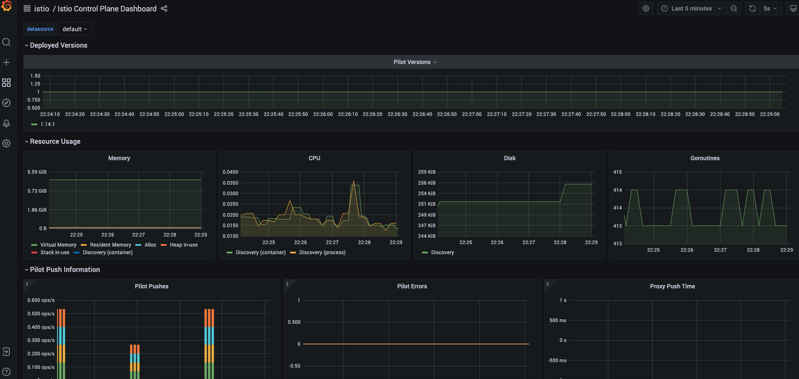
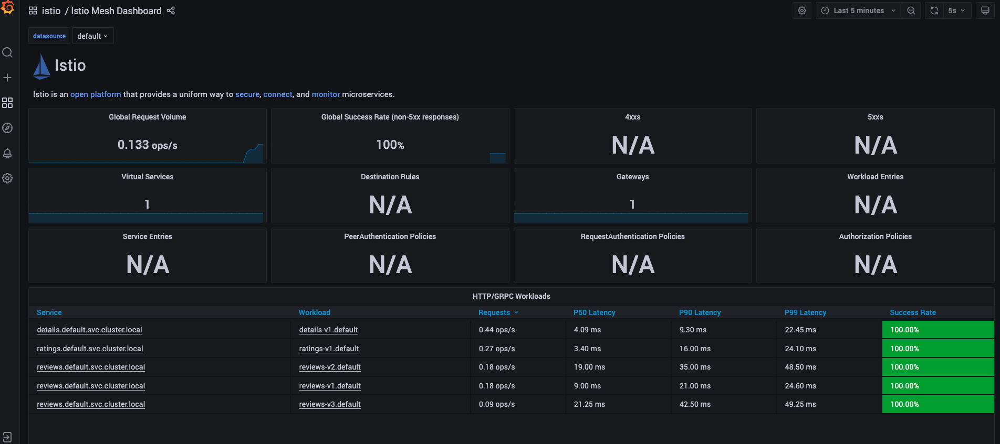

# Istio - Service Mesh for microservices deployment

Detailed process of setting up istio and related addons to ensure a complete microservice deployment using service mesh.

To run this example here are the pre-requisites

* You have a Kubernetes setup. Easiest option is to setup [Rancher Desktop](https://rancherdesktop.io/)
* You have Helm, Docker CLI and kubectl. You get all of this if you install Rancher Desktop out of the box.
* You have atleast 6 CPUs and 8 GB of memory configured on Kubernetes to setup istio and all addons and deploy sample example provided.

# Setting up Istio 1.14 version

Lets use Helm to setup Istio on our Kubernetes cluster. Here a quick preview on how the entire system is being setup.


We will be setting up istiod service (control plane), as and when the applications are deployed on an istio enabled namespace, envoy proxy would be dynamically injected. We will also setup istio ingress service.

## Configure Helm Repository

Run the following commands from the command prompt.

```bash
helm repo add istio https://istio-release.storage.googleapis.com/charts

helm repo update
```

## Installing Istio

* Create the 'istio-system' namespace where istio will be installed.

    ```bash
    kubectl create namespace istio-system
    ```

* Install the Istio base chart which contains cluster-wide resources used by the Istio control plane

    ```bash
    helm install istio-base istio/base -n istio-system
    ```

* Install the Istio discovery chart which deploys the istiod service

    ```bash
    helm install istiod istio/istiod -n istio-system
    ```

This will complete the setup of Istio.

## Uninstalling Istio

Incase you want to uninstall istio, here are the commands for you

```bash
# delete istio and istio-system namespace
helm delete istiod -n istio-system

helm delete istio-base -n istio-system

kubectl delete namespace istio-system
```

For more details, visit istio [installation section using helm charts](https://istio.io/latest/docs/setup/install/helm/).

# Setting up Istio Addons (Integrations)

We will be setting up the following in the same order.


## Setting up Jaeger

Jaeger - an open source end to end distributed tracing system, allowing users to monitor and troubleshoot transactions in complex distributed systems.

Run the following command to setup Jaeger.

```bash
kubectl apply -f https://raw.githubusercontent.com/istio/istio/release-1.14/samples/addons/jaeger.yaml
```

After the service is installed, run the following command to check that the pod related to Jaeger is running.

```bash
kubectl get pods -n istio-system
```

## Setting up Prometheus

Prometheus - an open source monitoring system and time series database

Run the following command to setup Prometheus.

```bash
kubectl apply -f https://raw.githubusercontent.com/istio/istio/release-1.14/samples/addons/prometheus.yaml
```

After the service is installed, run the following command to check that the pod related to Prometheus is running.

```bash
kubectl get pods -n istio-system
```

## Setting up Grafana

Grafana - an open source monitoring solution that can be used to configure dashboards for Istio. You can use Grafana to monitor the health of Istio and of applications within the service mesh.

Run the following command to setup Grafana.

```bash
kubectl apply -f https://raw.githubusercontent.com/istio/istio/release-1.14/samples/addons/grafana.yaml
```

After the service is installed, run the following command to check that the pod related to Grafana is running.

```bash
kubectl get pods -n istio-system
```

To access grafana UI run the following command

```bash
kubectl port-forward svc/grafana 3000:3000 -n istio-system
```

Now you should be able to access grafana at http://localhost:3000

## Setting up Kiali

Kiali - an observability console for Istio with service mesh configuration and validation capabilities. It helps you understand the structure and health of your service mesh by monitoring traffic flow to infer the topology and report errors. Kiali provides detailed metrics and a basic Grafana integration, which can be used for advanced queries. Distributed tracing is provided by integration with Jaeger.

Kiali with istio needs a small modification before its deployed. Download the [kiali.yaml](https://raw.githubusercontent.com/istio/istio/release-1.14/samples/addons/kiali.yaml) file to your local desktop. Edit the file to add the grafana url as it is not configured by default.

Under the kiali ConfigMap->data->external_services add the following (search for external_services in the kiali.yaml file and append the content)
```yaml
    external_services:
    ....
      istio:
        root_namespace: istio-system
      grafana:
        url: "http://grafana:3000/"
```

Now you can run the following command to deploy it.

```bash
kubectl apply -f kiali.yaml -n istio-system
```

After the service is installed, run the following command to check that the pod related to Kiali is running.

```bash
kubectl get pods -n istio-system
```

To access kiali UI run the following command

```bash
kubectl port-forward svc/kiali 20001:20001 -n istio-system
```

Now you should be able to access kiali at http://localhost:20001

## Installing a Sample Application

Now we will try to install a sample application provided by Istio themselves called bookinfo.


The sample application provides an example for 4 services the productpage, reviews, ratings and details.

How services call each other is as shown below.

* productpage -> details
* productpage -> reviews -> ratings

Lets follow the steps below to install the service.

* Enable istio on the default namespace where we will deploy the bookinfo microservice using the command below.
    ```bash
    kubectl label namespace default istio-injection=enabled
    ```

* Deploy the bookinfo sample application using the following command
    ```bash
    kubectl apply -f https://raw.githubusercontent.com/istio/istio/release-1.14/samples/bookinfo/platform/kube/bookinfo.yaml
    ```

* Port forward the application on the local machine and access the application on http://localhost:9080/productpage?u=normal
    ```bash
    kubectl port-forward svc/productpage 9080:9080
    ```

Once you have created the application, you can generate some load on the application. You will be able to see the details on the kiali dashboard as shown below.


Ensure the following.

* You have selected the default namespace
* Under display, you have selected the Response Time, Throughput, Traffic Distribution, Traffic Rate, Traffic Animation options.

Here is a sample python script to generate load, one request per second.

```python
import time
import requests

url = 'http://localhost:9080/productpage'

for lp in range(1000):
    print(lp)
    try:
        headers = requests.utils.default_headers()

        headers={'User-Agent': 'Mozilla/5.0 (Windows NT 10.0; Win64; x64) AppleWebKit/537.36 (KHTML, like Gecko) Chrome/102.0.0.0 Safari/537.36'}

        response= requests.get(url.strip(), headers=headers, timeout=10)
    except:
        print ("An error occurred")
    time.sleep(1)    
```

Save the script in a file called 'urlhit.py' and run the same using

```bash
python3 urlhit.py
```

You can also check the grafana dashboards where you can see the required metrics related to SRE under the istio folder. Here is a glimpse of how it would look.



